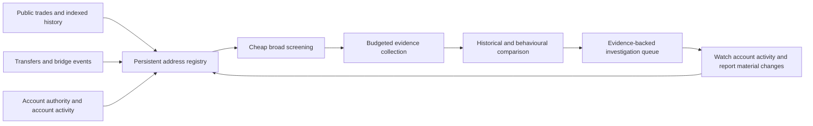

**Ezekiel: finding the trader's other and future Hyperliquid wallets**

Review dates: 25-26 September 2026. Evidence: the current checkout, including detector outputs dated 23 September, implementation, tests, previous investigations, and current primary-source API documentation. These saved outputs are not a live deployment health check.

**Recommendation:** preserve the existing direct-link tripwires, repair the discovery and evidence pipeline, then add market-wide wallet discovery and a properly evaluated behavioural search. More scoring rules on the present inputs will not solve the central problem.

Success means identifying an actionable Hyperliquid trading account, with evidence and an appropriate confidence level, soon after it becomes observable. Finding a treasury, an exchange, or a similar trader is an intermediate result. Public data cannot guarantee identification of a completely separated wallet funded through opaque custody and operated differently. The design must expose that uncertainty rather than manufacture a match.

This is a review and proposed direction, not an implemented change. No production code or tracking data was changed. The recommendations distinguish work possible within the existing free setup from capabilities requiring continuous hosting or additional data access.

**1. Findings that materially affect results today**

**1.1 The live scanner omits a feature the backtest uses.**

`scanner.scan_leaderboard` prefers `profile/fingerprint_recent.json`. `fingerprint.build_fingerprint_recent` does not include `order_profile`; the full fingerprint and backtest do. Consequently, fetching a candidate's historical orders cannot produce an order comparison against the recent target fingerprint.

Measured in `data/scans/latest.json`: **150 of 150 retained results have `order_profile: null`**. Several of the top candidates nevertheless contain populated order profiles. The saved full target profile reports approximately 94.77% IOC orders, so this is a potentially useful observed characteristic that the live comparison cannot use. It does not prove human rather than automated execution: bots can issue IOC orders without client order IDs.

Fix the common feature-building path and test the fingerprint actually consumed by the production scanner. Revalidate after correcting the feature, rather than assuming its addition improves identification. References: `src/fingerprint.py:750`, `src/scanner.py:1797`, `src/scanner.py:359`.

**1.2 Six current correlation leads are based on already-explained movements.**

I joined the six saved correlation results to their original transfer records and existing bridge decodes:

| Candidate prefix | Heuristic score | Alleged exit | What the project already knows |
|---|---:|---:|---|
| `0xeaad1c35` | 0.9424 | $6,000,000 | CCTP extension deposit credited to the target's own HL account |
| `0xb798aef7` | 0.7740 | $5,800,000 | CCTP extension deposit credited to the target's own HL account |
| `0xb83de012` | 0.7482 | $5,999,999.80 | Transfer to configured known-self wallet `0xf078969e...` |
| `0xfe572cd2` | 0.6503 | $2,200,000 | CCTP extension deposit credited to the target's own HL account |
| `0x60a8c761` | 0.6458 | $6,999,999.80 | Transfer to configured known-self wallet `0xf078969e...` |
| `0xf5d81a13` | 0.6216 | $3,500,000 | CCTP extension deposit credited to the target's own HL account |

For example, source transaction `0x9f3e0a9ab376c9dc4a1a8cc4f0df844681fb755290c31ba535e4da6e577cc316` is decoded in `data/labels/bridge_decodes.json` with `hl_account` equal to the target. That same movement seeds the highest correlation result.

This does **not** prove these candidate wallets are unrelated. It means the claimed unresolved exit is invalid evidence for the proposed match. `collect_target_exits` admits all sufficiently large target outbounds without first reconciling self-transfers and known bridge destinations. Its ordinary HL withdrawals can also represent an earlier leg of the same capital movement.

Build a cluster-level economic movement ledger first. Continue tracing internal transfers onward, but only offer the genuinely unresolved leg to cross-exchange matching. References: `src/correlator.py:198`, `data/correlations/latest.json`, `data/labels/bridge_decodes.json`.

**1.3 The correlator can consume an exit with a rejected match.**

`find_correlations` sets `used[best_i] = True` before testing the candidate's confidence. A read-only synthetic reproduction offered a $1M exit, a $975K deposit, and then a $1M deposit. The first candidate consumed the exit but failed the 0.55 threshold. The exact later match disappeared. Offered alone, that exact match scored 0.79.

Moving consumption after acceptance is a correctness repair, but still leaves a greedy first-arrival assignment. Retain competing hypotheses and solve assignment across the relevant window; do not allow an arbitrary unrelated early deposit to monopolise an exit. Reference: `src/correlator.py:119`, especially line 165.

**1.4 Candidate histories are truncated and the time coverage is often inadequate.**

`get_candidate_fills` makes one `userFillsByTime` request and does not paginate. **92 of 150 saved results contain exactly 2,000 fills.** That is a saturation warning, not proof that all 92 have missing records. All 150 results lack a usable timing comparison; the saved recent target profile itself covers only seven active days, below the ten-day timing minimum. All 150 also lack a loss-handling comparison.

The API documents a maximum of 2,000 fills per response and availability of only the most recent 10,000 fills. Pagination can retrieve the available window; it cannot recover everything outside that retention limit. The repository already recognises the oldest-page issue in its co-movement collector, but the main scanner still makes the single-page request. [Hyperliquid info endpoint](https://hyperliquid.gitbook.io/hyperliquid-docs/for-developers/api/info-endpoint)

Persist candidate fills incrementally, record saturation and actual time coverage, and score only features supported by the available history. Match equivalent observations: a few hours of a candidate's partial executions are not equivalent to the target's complete multiweek history. References: `src/scanner.py:196`, `src/fingerprint.py:264`, `scripts/check_comovement.py`.

**1.5 A previously expanded wallet can disappear from future fund-flow observation.**

`transfer_graph.expand_frontier` persists an `expanded_ledger` and excludes those wallets from future expansion. The saved graph reports **2,219 already-expanded wallets, zero new lookups, and zero eligible frontier wallets**. This is completion of historical exploration, not evidence that those wallets will never move again.

The close watch covers three wallets in this snapshot. A low-ranked recipient can receive funds, remain quiet when first explored, then forward them later while never entering that close watch. The current permanent expansion flag is not a refresh schedule.

Separate backfill completion from incremental surveillance. Each relevant wallet needs a last-observed time, per-chain cursor, next check, and conditions that increase its priority. Also re-open an explored wallet when chain coverage or a decoder changes. References: `src/transfer_graph.py:2158`, `src/transfer_graph.py:2188`, `data/watchlist/latest.json`.

**1.6 Discovery favours wallets that have already become large.**

The latest newborn report lists 46,923 leaderboard rows. The main sweep selects the largest 500; newborn discovery requires $1M and only 30 newborns are prioritised. Bridge-depositor scans rank the largest deposits and keep 120. The Circle candidate pool drops deposits below $100K at storage time.

A small test-funded wallet, a split-capital account, an older pre-funded account, or an account absent from the leaderboard can therefore evade the broad discovery routes. Direct cluster-contact alerts have different coverage and can still catch small transfers; this finding does not imply that all small transfers are invisible.

References: `src/scanner.py:167`, `src/scanner.py:1193`, `src/newborn.py:64`, `src/cctp_feed.py:60`.

**1.7 Candidate updates and downstream visibility are incomplete.**

There are **868 individual candidate files**, but `data/candidates/latest.json` contains just **50**, ordered by historical `best_score`. The roster reads that shortlist for behavioural evidence. A recent promising candidate can be excluded by older high-water marks.

Moreover, both scan paths persist a result only when it remains above a threshold or has a non-background disposition. A candidate that falls to background can retain an older supposedly latest score. One concrete example: `0x960b6c2c...` has 0.4615 in the latest scan but 0.6157 dated the previous day in its individual candidate file.

Use one complete candidate registry, always update outcomes for candidates already known, and build display shortlists as views. Keep `last_checked`, `last_successful_read`, `last_scored`, and `last_positive_evidence` separate. References: `src/scanner.py:1065`, `src/scanner.py:1130`, `src/scanner.py:1752`, `src/scanner.py:1910`, `src/roster.py:760`.

**1.8 The validation result does not establish live migration recall.**

The latest saved backtest **passes**: self-score 0.6642, 20 strangers, margin 0.1117. I am not carrying forward the older documentation's claim that it is currently failing. The scan and roster precede that report, so their disabled behavioural policy is not, by itself, evidence of a policy propagation bug.

There are nevertheless substantial validation gaps:

- Both target windows receive the same latest position state. Historical leverage/account-state comparisons therefore are not independent as-of reconstructions.
- The backtest includes target order profiles, while the live recent fingerprint omits them.
- Strangers come from the scan's retained fingerprint summaries, effectively its top 20, rather than a fixed representative evaluation cohort.
- The backtest fetches stranger orders only if the `order_profile` key is absent. Summaries can contain that key with an empty dictionary, leaving the proposed parity unfulfilled.
- Passing does not require a minimum number of strangers: an empty stranger set can produce rank 1 with no margin failure.
- The scanner's current resolved high threshold is 0.6442, but the roster still requires the literal 0.65 for a behavioural vote.

These are reasons to add realistic evaluation, not reasons to lower thresholds until a desired wallet wins. References: `src/backtest.py:278`, `src/backtest.py:301`, `src/backtest.py:343`, `src/roster.py:776`.

**1.9 Several labels overstate what their evidence means.**

- `transfer` and `hl_native` can derive from the same HL transfers, so two module labels are not necessarily two independent observations. The saved treasury row contains both. Its configured known-self status is separate ground truth; the broader aggregation rule still needs repair.
- A shared agent establishes shared signing authority, which may be a delegated operator, not necessarily the same beneficial owner. A shared private deposit address suggests a shared account or relationship; it is not cryptographic proof of personal ownership. Payments, brokers and custody arrangements are alternative explanations.
- `compute_order_profile` calculates cancellation as one minus the filled fraction, counting open/rejected/triggered records as cancellations. An open and later filled observation of one order yields a synthetic 50% cancellation rate. Normalize lifecycle events by account and order ID before calculating actual cancellation behaviour. Saved candidate profiles with approximately half their rows marked open warrant checking the raw response semantics.
- A contract address is not automatically shared infrastructure. Individually controlled smart wallets and smart-contract routes need a different classification from public routers.

References: `src/roster.py:648`, `src/roster.py:658`, `src/roster.py:195`, `src/fingerprint.py:141`, `src/linkage.py`.

**1.10 The accounting headline does not measure successful re-identification.**

`data/accounting/latest.json` reports **95.18% traced**, but **76.90% of gross outflow is classified as infrastructure**. Reaching an exchange or a protocol is useful knowledge; it does not identify the next trading account. These are historical gross flows, not distinct capital or present assets: money can appear repeatedly as it circulates.

Publish separate measures for immediate destination classified, economic route resolved, final controlled recipient identified, and unresolved custodial value. Net internal cluster movements and avoid counting a bridge's two legs twice. Reference: `src/accounting.py:121`.

**1.11 Bridge-side visibility is useful but incomplete.**

The transfer summary explicitly lists **Base, Optimism and BSC as unsupported** by the configured plan. Circle receipt visibility does not fully replace source-chain tracing. For example, `target -> fresh EOA on Base -> Circle -> fresh HL account` can arrive with a previously unknown source sender.

Further, the five retained target Circle receipts all name the **CctpExtension contract `0xa95d9c1f...`** as `counterparty`. `decode_received` uses the burn message's `messageSender`; for contract-mediated burns this is not necessarily the original wallet funding the transaction. Existing source-side bridge decoding can recover the origin on covered paths, but the destination event alone is insufficient.

Join source and destination using protocol message identifiers and validated source transactions. Preserve message sender, transaction caller, token funder, relayer, and credited HL account as different fields. Also retain decoded global events: the current Circle watcher scans all events but saves only cluster-touching flows/findings, capped at 200, so it cannot later rerun discovery over a complete historical source-to-account index. References: `src/circle_flows.py:84`, `scripts/check_circle_flows.py`, `data/transfers/latest.json`.

**1.12 Failed reads can look like an absence of activity.**

After exhausting retries, `hl_post` returns an empty list or dictionary. `get_candidate_fills` also collapses failures into an empty list. Calling code therefore cannot reliably distinguish a successful query with no fills from a failed read using the returned value alone. Console error messages do not preserve that distinction in the evidence model. This is a verified code path, not a claim that a specific saved candidate suffered an API outage.

Return an explicit read status with source, observation window and retry state. Preserve the last successful observation, mark current evidence unavailable or stale, and retry without treating an outage as inactivity. Cursor advancement and identity demotion must require appropriate successful coverage. Reference: `src/utils.py:23`, `src/scanner.py:196`.

**2. The highest-impact change: search the venue, then investigate candidates**

The present architecture repeatedly asks whether a selected wallet is him. The missing complementary capability is to find the addresses worth asking about in the first place.

Use the following flow:

**2.1 Public trade-tape discovery.** Hyperliquid documents `users: [buyer, seller]` on its public market trade stream. Capture participating addresses from relevant perp and HIP-3 markets, expanding coverage as capacity allows. This discovers small and previously unknown accounts even when they have no financial link to the target. Keep direction, market, event time and trade identity, not just an address list. Stream observations do not by themselves establish identity. [Hyperliquid websocket subscriptions](https://hyperliquid.gitbook.io/hyperliquid-docs/for-developers/api/websocket/subscriptions)

Start with the target's markets plus a rotating exploration allocation; a target-market-only feed can miss a strategy change. Track which markets and time intervals were actually observed. Public tape offers filled executions, not every unfilled order or every account action; use targeted order queries or a richer feed for those.

**2.2 Search historical address-level data.** Obtain a bounded historical slice around important target activity changes and current unexplained movements. This lets the system discover wallets that were already active before monitoring began and evaluate ideas on actual observations. Hyperliquid publishes node fill and action archives; archive transfer costs are requester-paid. [Hyperliquid historical data](https://hyperliquid.gitbook.io/hyperliquid-docs/historical-data)

A provider may be more convenient, but verify the exact product, tables, historical coverage, available fields, lag and price. Dune's current curated perpetuals dataset advertises account/position/trade data, executions from July 2025 and hourly refreshes, **but explicitly lists the dataset as an Enterprise add-on**. It is not a free solution simply because ordinary Dune queries have a free offering. Its curated perpetuals collection also excludes spot and prediction markets. [Dune perpetuals dataset](https://dune.com/data/perpetuals-trading)

**2.3 Progressive enrichment instead of fixed shortlist exclusion.** Maintain every address seen, with cheap features and a scheduled next action. Spend expensive per-wallet calls on the most informative next measurement: recent fills, first activity, source of funding, agents, subaccounts, order behaviour or withdrawal destinations. Reserve a fixed exploration budget so low-balance and unfamiliar wallets are not permanently starved.

Separate detection thresholds from alert thresholds. Keeping a small new depositor in a registry is inexpensive compared with deeply tracing it or paging the operator. Do not discard that discovery merely because it is not yet strong enough to alert.

**2.4 Search old accounts as well as newborns.** Track reactivation after a long quiet period, new capital, changed trading activity, new agent approvals and a new execution pattern in an existing address. All-time volume approximately equalling monthly volume establishes that most observed trading is recent; it does not establish account creation or ownership.

**3. Fund tracing that can survive indirect and delayed migration**

**3.1 Reconcile economic actions.** Model a movement as linked legs: HL withdrawal, bridge payout, swap, bridge burn, mint, final HL credit. Attach raw transaction/event IDs, quantities, fees, coverage and decode provenance. Use exact protocol relationships before amount/time heuristics. A target self-deposit should be resolved as such automatically and excluded from unresolved-exit matching.

**3.2 Trace from the whole known cluster.** Include the target, established treasuries and protocol-explicit related accounts. Prefer route provenance over a broad rule that every inferred CONFIRMED account immediately becomes ground truth. Keep an investigatory cluster separate from trusted seeds to prevent one mistaken association contaminating later discoveries.

**3.3 Revisit delayed relays.** Separate each address's historical completion cursor from its surveillance schedule. A low-activity recipient with retained funds deserves periodic reads; a new outbound or bridge action should trigger immediate route expansion. Maintain a second queue for reactivation, independent from unexplored-wallet discovery.

**3.4 Make source-chain gaps explicit and actionable.** Add alternative chain readers where available; the existing Blockscout integration already provides a starting point on Base/Optimism, though full transaction/token/internal-history adapters need their own coverage validation. For BSC and other gaps, compare available provider coverage or query canonical token logs over bounded ranges. Do not label a chain covered merely because balances can be read. Follow paths that can reconnect to Hyperliquid first.

**3.5 Preserve small funding events.** Retain low-value gas funding and test transfers into a cheap address/event index. Escalate a wallet when several clues join: new funding, approval, bridge deposit, first HL activity. Validate token contracts, actual transfer success, and whether the recipient ever uses the funds; dust and address poisoning must not become ownership evidence.

**3.6 Expand private-deposit-address sentinels carefully.** Keep the existing two-sided monitoring, add assets/chains as verified, and watch newly used private deposit addresses from any trusted cluster wallet. Examine both new senders and subsequent HL activity. Recheck whether an address is quiet, customer-specific and actually forwards to a known exchange; an old label is not eternal proof.

**3.7 Match CEX gaps as competing explanations.** A useful matching model retains candidate exit/entry pairs with route, asset, amount, delay and alternative matches. Solve globally within a bounded window, allowing unmatched flows. Use observed fee/delay distributions and time-shuffled controls; publish ambiguity. An exchange hot wallet cannot reveal the customer's internal account routing, so shared exchange origin alone is weak.

**3.8 Allow split, merge and partial redeployment.** Search bounded groups of related exits and deposits, not only one-to-one amounts. Consider a migration deploying 20% of the capital or several instalments. Constrain combinations by time, token conservation, route and candidate account activity to avoid finding arbitrary subset sums by chance. Check existing `continuity.reconcile_split_merge` functionality before adding another isolated heuristic; it needs to operate on the actual unresolved movement pool.

**3.9 Look for repeated paths and return flows.** A repeated private round trip across several dates is more informative than a single round-million coincidence. Compare alternative explanations such as loans, payments and OTC settlement. Reuse a verified intermediate address as a surveillance seed even if the final wallet is still uncertain.

**3.10 Treat gas sponsors, wallet contracts and bridges as typed actors.** Record deployer/factory/owner/module links where publicly exposed, gas funders where not shared faucets/exchanges, and the real recipient behind routers. Stop ownership propagation at public liquidity pools and shared custody boundaries; continue route discovery through a decoded bridge rather than through every user of the bridge.

**4. Behavioural recognition that measures trading decisions**

The target has many fills but relatively few independent decisions. A fingerprint dominated by slice count, currently popular assets or account size is fragile. The proposed unit of analysis is an order, execution episode or deliberate position change.

| Method | What to measure | Why it may help | Main confounder / validation requirement |
|---|---|---|---|
| Execution episodes | Reconstruct orders and related slices using `oid`, `twapId`, position changes and time | Separates an intended trade from thousands of partial fills | Incomplete windows; distinguish observed start/end from censored episodes |
| Order submission habits | TIF, triggers, reduce-only, modification/cancel rates, client IDs | Often travels across addresses | Shared frontend/SDK defaults and lifecycle duplicates |
| Slice scheduling | Inter-order intervals, pauses, restarting, duration, variation | Can distinguish execution routines | Liquidity, execution service, native TWAP defaults |
| Size choice | Base-quantity versus quote-notional targeting; rounding after tick/lot normalization | Describes order intent instead of capital level | Market price and venue precision rules |
| Position management | Entry ladders, partial exits, re-entry delay, scaling with profit/loss | More specific than long/short percentage | Regime changes; compare similar opportunities |
| Basket transitions | Ordered sequence of markets and position changes | Rare combinations can narrow a broad search | Copying and shared news |
| Conditional decisions | Response to returns, volatility, funding, basis or drawdowns | Separates shared market exposure from individual policy | Need contemporaneous market data and sufficient episodes |
| Pair/spread behaviour | Relative sizes, timing and rebalancing of legs | Finds strategic consistency across wallets | Common arbitrage strategies |
| Session timing | Starts, stops and gaps per independent session | Less sensitive to one huge TWAP than fill-hour histograms | Timezone alone is common; sparse data stays unknown |
| Operational history | Agents, account setup, funding route and first actions | Useful before substantial trading exists | Shared services and automation templates |

Implement transparent features before complex machine learning. Store multiple reference windows: longer-term operating habits, recent strategy, and distinct observed regimes. A candidate should be compared with plausible regimes without silently selecting whichever comparison flatters it; calibrate the maximum-over-regimes rule against the same negative population.

Use early-life profiles at five orders, one session, several sessions and longer history. An empty or partial book is not a failed match. Report an information level alongside similarity, with uncertainty based on independent sessions rather than raw fill counts.

Absolute style vetoes should not be allowed to erase a direct protocol relationship. A trader can change execution software or assign a bot to a second wallet. Keep contradictory behaviour as evidence and distinguish common control, same strategy and active successor. Evaluate any change to behavioural veto policy on held-out data first.

More sophisticated options, after collection and evaluation work: sequence alignment over basket transitions; nearest-neighbour retrieval over episode embeddings; mixture models for multiple target regimes; sequential evidence accumulation. There is currently insufficient labelled ownership data to advertise an accurately calibrated identity probability from a supervised classifier. Temporal samples of one trader do not become hundreds of independent labelled people.

**5. Creative routes worth testing, with explicit limits**

**5.1 Reverse-index authority relationships across the venue.** Existing agent checks inspect up to 120 chosen wallets. Build an index of `approveAgent`, revocations, subaccount/master and multisig relationships from a validated global action source or bounded historical archive. Look for reuse of an old agent even after the current endpoint no longer reports it. Hyperliquid documents that agents can be deregistered or pruned; current snapshots do not preserve the full relationship history. Record validity intervals. [Hyperliquid API wallets](https://hyperliquid.gitbook.io/hyperliquid-docs/for-developers/api/nonces-and-api-wallets)

Do not assume a global action subscription exists on the ordinary public websocket: source availability, fields and continuity must be verified. Node data supports fills, order statuses, miscellaneous events and transaction records, but a full non-validator node is substantial infrastructure, not a small polling replacement. The official repository currently recommends 16 vCPUs and 128 GB RAM for a non-validator. A hosted stream or selective archive processing is a more plausible starting point. [Hyperliquid node repository](https://github.com/hyperliquid-dex/node)

**5.2 Detect the first trading account funded by a newly discovered treasury.** Run an inverse query over the funding graph: for every credible new operational wallet, list the HL accounts it has actually funded. Rank those endpoints by current trading activity. This converts off-chain/other-chain research into the deliverable, instead of expanding an interesting treasury graph indefinitely.

**5.3 Detect position handoffs without a visible transfer.** Search for the target reducing a distinctive basket while one account, or a small group, builds a similar basket. Compare position quantities and changes, not simply USD account-value ratios. Control for price changes, leverage, deposits and withdrawals. Market-wide reactions can produce the same pattern; this is an investigative trigger, not ownership proof.

**5.4 Compare the aggregate of several small accounts.** A trader may distribute a book across multiple wallets. Start with accounts sharing independent route/authority evidence, then test whether their combined execution and exposures resemble the target. Do not search arbitrary combinations of thousands of accounts until one fits.

**5.5 Observe return-path mistakes.** A fresh wallet may be funded cleanly but later return capital to an old treasury or private deposit address. Keep candidate histories and periodic surveillance long enough to catch the eventual link. Back-propagate the new factual relationship through stored observations and re-evaluate earlier leads.

**5.6 Identify the execution process, then test who controls it.** Stable IOC timing, duration, interruption/restart patterns and order-size rounding may identify an execution routine. That is not automatically a person: compare other users of the same frontend or bot. Pair it with funding or authority evidence before elevating identity.

**5.7 Improve copier discrimination with adequate data.** The saved co-movement report has **24 of 24 results untestable**. This is insufficient evidence, not proof that copying or co-movement is absent. Current decision pairing can assign multiple candidate decisions to the same target decision; require one-to-one episodes or account for the dependence. Use multiple shifts/permutations preserving sessions, market regimes and coverage. A candidate sometimes leading the target is not by itself proof of common ownership; both may react to the same information.

**5.8 Follow a cohort of likely copiers as a research hypothesis.** If a stable group stops following the target and begins following a new account, that account becomes worth investigating. First establish that the cohort follows rather than simply trades popular markets. This needs venue data and sufficiently many target decisions; it is not an immediate production detector on the present record.

**5.9 Join matching trade events where a handoff is plausible.** Same-market, same-event buyer/seller joins can find direct crossings. Repeat matches in rare circumstances deserve investigation; an ordinary fill has a counterparty by definition and proves no ownership. The previous investigation found no such relationship in its sampled windows. Reconsider only when wider or fresher coverage changes the experiment, not by repeating the same negative query.

**5.10 Use public self-disclosures as dated hypotheses.** A voluntarily published screenshot showing an unusual market, position, entry and time can define a narrow historical search. Public agent/referral/vault names can contribute weak corroboration. Preserve source and publication time, and distinguish the person hypothesis from the known target wallet. The unconfirmed GCR hypothesis must never become a training label or a circular reason to declare a match. Broad social scraping and invented identity claims are not substitutes for transaction evidence.

**5.11 Approvals and off-HL operational sequences.** The trader's documented Aave/Pendle/Morpho/bridge use makes operational sequencing worth a targeted comparison on serious HL candidates. An unusual approval sequence, gas top-up and bridge route can support a lead. Common protocol use, shared gas defaults or a common spender alone are weak. This is a selective enrichment tool, not a reason to scan every unrelated DeFi wallet.

**5.12 Learn where investigations actually stop.** Maintain a machine-readable unresolved-route queue: boundary, last verified transaction, amount, candidate endpoints, missing field, next useful query and reason it is currently blocked. Pick the next action by likely information gained per API cost. The existing narrative investigation log is useful history, but cannot schedule these measurements or automatically react when new data becomes available.

**6. Evidence aggregation and validation must change with discovery**

Store every observation with a stable ID, event time, observation time, source, coverage and parser version. Derived signals name their parent observations. Signals sharing an underlying transfer or derived score form one evidence family; independently written detector files do not make them independent.

Maintain distinct assertions:

- **Protocol relationship:** the platform explicitly links accounts or signing authority.
- **Financial association:** money moved or a private route was reused.
- **Behavioural resemblance:** trading decisions look similar under the stated comparison.
- **Active successor hypothesis:** an account is plausibly taking over the target's trading.

A known treasury can be related with high confidence while being useless for following trades. A promising trading account can be worth investigating before it is justified to call it owned by the target.

The evaluation programme should include:

1. **A historical hide-and-seek test.** Remove a known related wallet from seed/config data and replay discovery chronologically. Measure whether the ingestion, selection, enrichment and ranking pipeline finds it, not just whether a scoring function recognises supplied features. Known treasuries mostly test graph discovery, not the ability to identify a trading successor.
2. **Pseudo-migrations across target sessions.** Assign post-cutoff target observations a hidden test address, reduce starting capital, remove direct funding, and reproduce actual API truncation and timing. Prevent pre-cutoff features from seeing future account state. These simulations measure known failure modes; they are not independent proof of cross-wallet identity accuracy.
3. **Real held-out relationships where available.** Public explicit subaccounts or consenting test accounts can evaluate protocol links. Keep them separate from unverified inferred associations. No money-moving drill is necessary to test recorded event handling.
4. **Hard negative controls.** Similar-size discretionary traders, bots using the same frontend, common-exchange customers, shared-vault users, copycats and traders reacting to the same market events.
5. **Candidate-quality-matched evaluation.** Equal history limits, feature availability, active-session counts and as-of state on both positive and negative sides. Missing-data patterns need their own calibration.
6. **Frozen development/test periods.** Develop feature choices on earlier periods and test once on later held-out periods. Do not optimise the same self-match that is used to declare validation.
7. **Repeated-search controls.** The calibration currently retains 1,000 score/time observations without wallet IDs or feature-version metadata. Repeated correlated scans are not 1,000 independent strangers. Store cohort identity and feature masks. Estimate false discoveries per day and among the actual investigation shortlist, not just a score percentile.
8. **Offline route replays and delivery canaries.** Replay known transfer, bridge, subaccount and agent events under a substituted test cluster and mock notification sink. Separately test delivery health with an explicitly identified canary when authorised. These tests do not require the target's private keys.

Measure discovery recall under each simulated route, recall at the top 5/20 investigation slots, time from first observable activity to candidate discovery, time to useful evidence, and false high-priority alerts per day. Also publish unobserved markets, stale accounts, chain gaps, saturated pages and queue age.

No method should earn a production role merely because it produces more candidates. It should improve a defined discovery or evidence metric on data it was not tuned against.

**7. What to build first**

| Order | Work package | Concrete acceptance condition |
|---|---|---|
| 1 | Reconcile exits before correlation; repair rejected-match consumption | The four decoded self-deposits and two known-self transfers above no longer masquerade as unresolved exits; the synthetic exact-match case remains available |
| 2 | Unify live/backtest features and normalize order lifecycle | The actual recent target fingerprint includes the supported order features; zero-order/missing data remains unknown; open orders are not cancellations |
| 3 | Persist every candidate outcome and remove the top-50 evidence bottleneck | A downgrade updates the existing candidate; all evidence-bearing candidates remain accessible to the roster independently of historical high scores |
| 4 | Candidate history, explicit read status and refreshed-wallet scheduling | Available fill pages are collected without duplicate events; actual coverage is recorded; failed reads remain distinct from inactivity; a wallet forwarding funds after its initial exploration is detected |
| 5 | Discovery/evaluation harness and provenance | A chronological replay reports which stage misses a hidden account; related signals cannot count twice |
| 6 | Broad venue discovery pilot | Discover addresses outside the present leader/depositor lists; publish market/time coverage and cost, then compare recall against the old candidate funnel |
| 7 | Economic route index across bridges and private addresses | Query from original funder to actual HL credit with verified event joins; contract-mediated burns preserve the end-user distinction |
| 8 | Episode-based behavioural retrieval and advanced hypotheses | Show held-out improvement in recall at a fixed investigation/false-alert budget before enabling new promotions |

Package 1 is the most immediate reduction in misleading results. Packages 3, 4 and 6 address the structural ways a future wallet can remain unseen. Package 8 is where additional pattern recognition becomes defensible.

**8. Runtime choices and costs**

| Option | Capability | Limitation / cost boundary |
|---|---|---|
| Existing free polling and relay | Correctness repairs, better candidate scheduling, incremental histories, explicit gap reporting | Cannot guarantee continuous public tape capture; verify the Apps Script relay is actually installed and running |
| Small continuous collector using public APIs | Public market tape, rapid cluster watches, durable address discovery | Needs an always-on host and storage; benchmark resource use before choosing a hosting plan |
| Selective archive/provider access | Historical discovery, realistic replay, richer action/order coverage | Verify fields and retention first; archive egress or provider access may be paid |
| Full non-validator node | Broad protocol-native data and local state | Much larger hardware/operations requirement; not the recommended first investment |

For streaming, respect current documented limits rather than assuming hundreds of per-user watches are free: Hyperliquid documents a limit of ten unique users across user-specific websocket subscriptions. Use market subscriptions for broad discovery and allocate the per-user slots to trusted cluster members and the strongest live leads. API pacing should use request weight and returned item count, not a universal sleep per call. [Hyperliquid rate limits](https://hyperliquid.gitbook.io/hyperliquid-docs/for-developers/api/rate-limits-and-user-limits)

A collector must persist before acknowledging progress, reconnect with overlap/deduplication, record gaps, and perform bounded recovery. Keep high-volume tape and candidate observations outside Git; continue publishing small materialised JSON reports for the existing dashboard. An append-only event store plus a small indexed database is sufficient initially. A wholesale dashboard rewrite or large distributed platform is unnecessary.

**9. Changes to earlier conclusions**

The previous investigations contain useful measurements, but several final conclusions were stronger than their evidence:

- **“No matches in this sample”** can justify deprioritising a method, not treating it as permanently disproven. Track which dates, markets, accounts and routes were actually tested.
- **“Co-movement untestable”** is a data-coverage outcome. It does not reject the idea; it blocks a reliable verdict today.
- **“The feeds know both ends”** does not mean a router-mediated transfer names the original funding wallet, nor that all decoded events are retained for future discovery.
- **“The accounting already covers migration”** confuses a classified first destination with the eventual trading endpoint.
- **“A fire drill needs his keys”** is incorrect for offline replay, parser contracts, substituted-cluster tests and delivery mocks. Live money movement is a separate, unnecessary action for this review.
- **“A platform change adds no discovery”** was reasonable when addressing file size alone; a small persistent global address/event index now directly enables new discovery methods. Keep its scope tied to that need.

Conversely, do not spend early effort resurrecting round-amount signatures, common validator overlap, timezone-only identity, blanket gas-fee similarity, or an assumed GCR identity. The existing negative evidence and obvious shared-service confounders still apply.

**10. Verification and practical conclusion**

I inspected the core scanner/fingerprint/backtest paths, transfer/correlation/continuity/roster/accounting paths, discovery/watch scripts, scheduling and alert integration, relevant dashboard data consumers, stored detector outputs, and prior investigation records. I reproduced the rejected-match consumption and order-status calculation issues with read-only synthetic inputs and cross-checked the six correlation exits against the stored transaction/bridge evidence.

The following existing targeted test selection passed: **344 tests, 19.97 seconds**. Modules covered order profiles, fingerprints, style matching, validation policy, thresholds, correlation, roster prioritisation/rescoring, continuity/adversarial cases, co-movement, Circle flows, deposit sentinels and feed health. The first sandbox attempt could not access pytest's Windows temporary directory; the authorised rerun passed. Passing these tests does not validate the discovery gaps identified above. The full suite and dashboard build were not run because no application code changed.

The highest-value shift is from a collection of detectors that inspect a narrow, repeatedly selected set of wallets to a system that preserves broad discovery, asks for missing evidence deliberately, and continuously revisits unresolved routes. Keep the useful existing work, fix the broken evidence paths, and judge every addition by whether it finds a hidden Hyperliquid account sooner at an acceptable false-alert rate.
